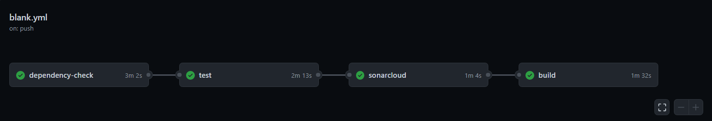
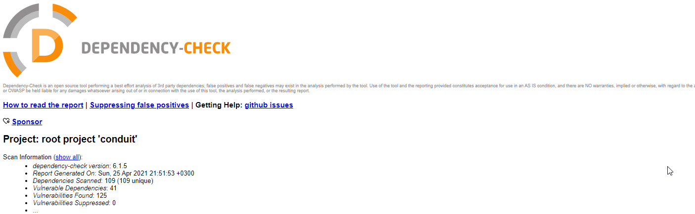
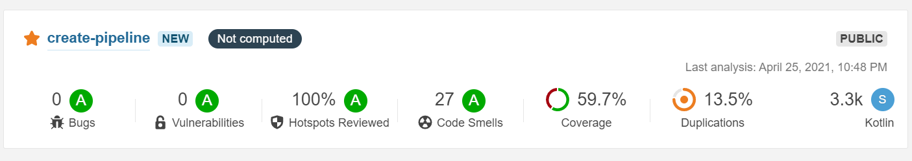
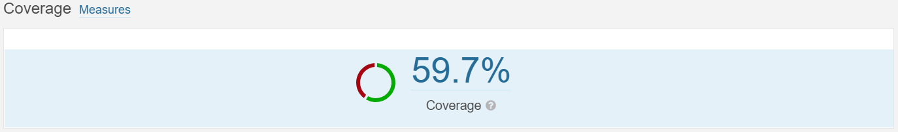
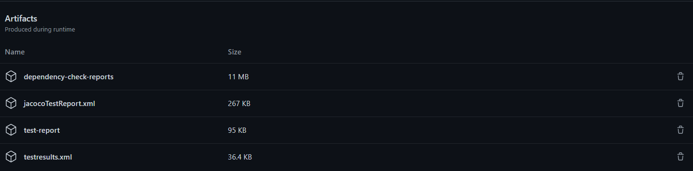

# 

[](https://github.com/ozlemgulp/create-pipeline/actions/workflows/blank.yml)

This project created purpose of creating a pipeline and learning GitHub actions.<br/>
Project cloned from [kotlin-http4k-realworld-example-app](https://github.com/alisabzevari/kotlin-http4k-realworld-example-app) public repo.<br/>
src code is not modified or changed! Changes done only on gradle.build.kts<br/>
**Check the latest run and results from [Actions](https://github.com/ozlemgulp/create-pipeline/actions) Tab of the repository.**<br/>

# Project Overview
* Project build with [Gradle](https://gradle.org/)
* Code with [Kotlin](https://kotlinlang.org/)
* Test with [Kotest](https://github.com/kotest/kotest/)
* Code static analysis performed with [SonarCloud](https://sonarcloud.io/dashboard?id=ozlemgulp_create-pipeline)
* Dependency checks performed with [OWASP Dependency-Check](https://owasp.org/www-project-dependency-check/)
* Code coverage performed with [Jacoco](https://www.jacoco.org/jacoco/trunk/doc/)

## Pipeline Structure
[](https://github.com/ozlemgulp/create-pipeline/actions)
Basically, workflow has **4** main jobs:
1. **dependency-check:** OWASP Dependency-Check identifies project dependencies on open-source code and checks if there are known vulnerabilities associated with that code.<br/>
2. **test:** Unit tests and Integration tests executed and results send to artifacts.<br/>
    2.1. Test Coverage: Code coverage calculated with Jacoco.<br/>
    2.2. Integration Tests:<br/>
  
3. **sonarcloud:** Code static analysis performed<br/>
    3.1. Test Coverage results published to the sonarCloud<br/>
    3.2. Integration test result published to the sonarCloud. (SonarCloud Kotlin Integratin Test [Bug](https://jira.sonarsource.com/browse/SONARSLANG-353) reported via Jira, After reported bug fixed, task expected to import results successfully.)<br/>
    
4. **build:** gradle task build<br/>

## dependency-check job
[](https://sonarcloud.io/organizations/ozlemgulp/projects)
dependency-check task generate OWASP dependency check report under the path: `./build/reports` in **ALL** format
* `./gradlew --stacktrace dependencyCheckAnalyze` command is creating the report
* Then created reports uploaded to the artifact. Check the [*github.com/user/repo/artifacts/latest*](https://github.com/ozlemgulp/create-pipeline/actions) for created reports and outputs.

>Add dependencycheck plugin to the **build.gradle.kts** :
```
	id("org.owasp.dependencycheck") version "6.1.5"
```

```
dependencyCheck {
    failOnError=false
	format=org.owasp.dependencycheck.reporting.ReportGenerator.Format.ALL
}
```

## test job

test job has **3** steps:
1. For the code coverage run `./gradlew test jacocoTestReport`. Created code coverage report uploaded to the artifact.
>Add jacoco plugin to the **build.gradle.kts** and enable xml report for further uses.
>xml format of report needed to publishing the results from SonarCube.

```
     jacoco
```

```
     tasks.jacocoTestReport {
    reports {
        xml.isEnabled = true
    }
}
```

2.  Run `./gradlew test` to run all tests. Then created test report uploaded to the artifact.
3.  Code Coverage Verification option `./gradlew test jacocoTestCoverageVerification`.
>Add jacocoTestCoverageVerification task to the **build.gradle.kts** and define minimum coverage limit:

```
tasks.jacocoTestCoverageVerification {
    violationRules {
        rule {
            limit {
                minimum = "0.8".toBigDecimal()
            }
        }
    }
}
```
## sonarcloud job
[](https://sonarcloud.io/organizations/ozlemgulp/projects)
* To perform code static analysis run `sonarsource/sonarcloud-github-action@master`. Results directlypublished on [SonarCloud](https://sonarcloud.io/dashboard?id=ozlemgulp_create-pipeline).
>**sonar.project.properties** file added to project working directory. 

```
sonar.organization=ozlemgulp
sonar.projectKey=ozlemgulp_create-pipeline

# relative paths to source directories. More details and properties are described
# in https://sonarcloud.io/documentation/project-administration/narrowing-the-focus/ 
sonar.sources=.
sonar.dependencyCheck.reportPath=/home/runner/work/create-pipeline/create-pipeline/build/reports/dependency-check-report.xml
sonar.coverage.jacoco.xmlReportPaths=/home/runner/work/create-pipeline/create-pipeline/build/reports/jacoco/test/jacocoTestReport.xml
sonar.junit.reportPaths=/home/runner/work/create-pipeline/create-pipeline/build/test-results

```
>Jococo test coverage report published via SonarCloud by defining jacoco xml Report path. Download the artifacts to the defined `sonar.coverage.jacoco.xmlReportPaths` path 
```
    - name: Download JococoTestReportArtifact
      uses: actions/download-artifact@v2
      with:
        name: jacocoTestReport.xml
        path: ./build/reports/jacoco/test/
```
```
sonar.coverage.jacoco.xmlReportPaths=/home/runner/work/create-pipeline/create-pipeline/build/reports/jacoco/test/jacocoTestReport.xml
```
[](https://sonarcloud.io/organizations/ozlemgulp/projects)

## build job
* To build the project `./gradlew clean build`. <br/>

## Artifacts
*After each job runs generated files or reports able to upload to the artifacts `actions/upload-artifact@v2` with defined  **name** and **path**.<br/>
*User able to download generated reports or files by clicking them.<br/>
```
      - name: 'Publish Test Report'
        if: always()
        uses: actions/upload-artifact@v2
        with:
          name: 'test-report'
          path: ./build/reports/tests/test/
```
[](https://github.com/ozlemgulp/create-pipeline/actions)<br/>

## For Detailed Information
To more information about github actions and generated pipeline please check [**blank.yml**](https://github.com/ozlemgulp/create-pipeline/blob/master/.github/workflows/blank.yml)
